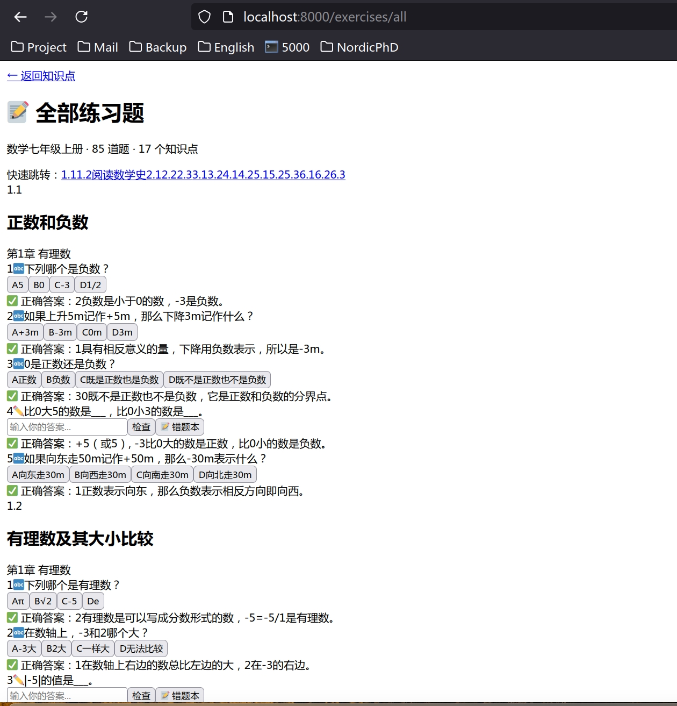

# JimmyCoach 🎓

> AI-powered tutoring coach for Jimmy — a personalized learning platform for Chinese middle school students.

**JimmyCoach** is a web application that combines textbook content, interactive exercises, mind maps, and an AI tutor to create an engaging self-study experience. Built for a 12-year-old student (Grade 7), it currently supports **Math** and **English**, with Chinese and Science planned.



## ✨ Features

### 📚 Textbook Learning
- **Per-section PDF viewer** — browser-native iframe with split PDFs
- **Key points display** — concepts, formulas, and tips per knowledge point
- **Interactive mind maps** — expandable tree visualization, downloadable as PNG
- **Auto-discovery** — new subjects appear on the home page automatically

### ✏️ Interactive Exercises
- **100 English exercises** across 10 sections (10 per section)
- **85 Math exercises** across 17 sections (5 per section)
- Three question types: multiple choice, fill-in-the-blank, true/false
- Instant answer checking with explanations
- **Word (.docx) download** — printable worksheets with answer keys
- **Error book** — per-subject tracking of wrong answers with review mode
- **Study progress tracking** — per-topic status (mastered / in progress)

### 🤖 AI Tutor (RAG Chat)
- **Per-subject TF-IDF retrieval** — Math (253 docs), English (37 docs)
- **DeepSeek API** integration with source attribution
- **Streaming typewriter effect** — SSE-based real-time responses
- **Per-subject chat history** — stored in SQLite, loaded on modal open

### 🛠 Admin Pipeline
- **Upload PDF** → AI parses table of contents → user confirms chapters
- **Auto-generates per section**: knowledge points, mind maps, 5 exercises, TF-IDF retriever
- **Task dashboard** with SSE progress, status colors, delete
- **Published content management** — delete subjects
- **Drag-and-drop** PDF upload with modal chapter confirmation

## 🏗 Tech Stack

| Layer | Technology |
|---|---|
| **Backend** | FastAPI (async Python) |
| **Templates** | Jinja2 + HTMX |
| **Database** | SQLite (async via SQLAlchemy + aiosqlite) |
| **AI** | DeepSeek API (via OpenAI-compatible SDK) |
| **Retrieval** | jieba + scikit-learn TF-IDF (Chinese text) |
| **PDF** | PyMuPDF (fitz) for splitting and text extraction |
| **Documents** | python-docx for Word worksheet generation |
| **Frontend** | Vanilla CSS + minimal JavaScript |

## 📁 Project Structure

```
JimmyCoach/
├── main.py                  # FastAPI entry point, lifespan, mounts
├── config.py                # Settings + shared constants (SUBJECT_NAMES, etc.)
├── requirements.txt         # Python dependencies
├── .env                     # DEEPSEEK_API_KEY (not committed)
├── jimmycoach.db            # SQLite database (generated at runtime)
│
├── routes/                  # HTTP route handlers
│   ├── pages.py             # Home, subject, lesson, mindmap pages
│   ├── exercises.py         # Exercises, Word download, error book
│   ├── chat.py              # RAG chat with SSE streaming
│   └── admin.py             # Pipeline management, upload, delete
│
├── services/                # Business logic
│   ├── ai_tutor.py          # DeepSeek API wrapper (singleton)
│   ├── retriever.py         # TF-IDF retriever (jieba + sklearn)
│   ├── pipeline.py          # PDF → knowledge-point automated pipeline
│   ├── progress.py          # Study progress tracking
│   ├── curriculum.py        # Curriculum data loading
│   └── chat_context.py      # Conversation context builder
│
├── db/                      # Database layer
│   ├── database.py          # Async engine, session, init
│   └── models.py            # ORM models (6 tables)
│
├── templates/               # Jinja2 HTML templates
│   ├── base.html            # Base layout (header, nav, footer)
│   ├── home.html            # Hero + subject cards + chat modal
│   ├── subject.html         # Chapter/topic listing with progress
│   ├── lesson.html          # PDF viewer + keypoints + mindmap + exercises
│   ├── all_exercises.html   # All exercises with quick-jump nav
│   ├── error_book.html      # Per-subject error tracking
│   └── admin.html           # Two-column admin with drag-drop
│
├── static/                  # Static assets
│   ├── style.css            # Complete app stylesheet (~600 lines)
│   └── htmx.min.js          # HTMX library
│
├── prompts/                 # AI system prompts (YAML)
│   ├── tutor_base.yaml      # Core persona: 小教练 (Little Coach)
│   ├── lesson_teach.yaml    # Lesson generation
│   ├── chat_free.yaml       # Free-form chat
│   ├── exercise_grade.yaml  # Answer grading
│   ├── exercise_hint.yaml   # Hint giving
│   └── exercise_gen_english.yaml  # English exercise generation
│
├── scripts/                 # Utility scripts
│   ├── split_pdf.py         # Split textbook PDF into per-section files
│   ├── extract_math.py      # Extract PDF text to markdown
│   ├── vectorize_math.py    # Build ChromaDB vector store
│   ├── add_metadata.py      # Add structural metadata chunks
│   └── gen_english_ex.py    # Generate English exercises via DeepSeek
│
├── data/                    # Data files
│   ├── textbooks/           # PDFs + markdown per subject
│   ├── exercises/           # Exercise JSON per subject
│   ├── keypoints/           # Key concepts per subject
│   ├── mindmaps/            # Mind map tree data per subject
│   ├── vectordb/            # TF-IDF retriever caches
│   ├── uploads/             # Uploaded PDFs
│   └── curriculum/          # Curriculum YAML definitions
│
├── tests/                   # Test suite (28 tests)
│   ├── test_routes.py       # Integration tests (8)
│   ├── test_models.py       # Model tests (4)
│   ├── test_curriculum.py   # Curriculum tests (6)
│   ├── test_progress.py     # Progress service tests (4)
│   └── test_ai_tutor.py     # AI tutor tests (6)
│
└── docs/                    # Reference PDFs + design specs
    ├── （人教版）义务教育教科书·数学七年级上册.pdf
    ├── （人教版）义务教育教科书·英语七年级上册.pdf
    ├── （统编版）义务教育教科书·语文七年级上册.pdf
    └── 新浙教版科学7年级上册电子课本.pdf
```

## 🚀 Getting Started

### Prerequisites

- Python 3.12+
- DeepSeek API key ([platform.deepseek.com](https://platform.deepseek.com))

### Installation

```bash
git clone git@github.com:AlexYangHZ/JimmyCoach.git
cd JimmyCoach

# Create virtual environment
python3 -m venv venv
source venv/bin/activate

# Install dependencies
pip install -r requirements.txt

# Set your API key
echo "DEEPSEEK_API_KEY=sk-your-key-here" > .env
```

### Run

```bash
python3 -m uvicorn main:app --host 0.0.0.0 --port 8000
```

Then open:
- **Home**: http://localhost:8000
- **Admin**: http://localhost:8000/admin

### Run Tests

```bash
python3 -m pytest tests/ -v
```

## 📖 Usage

### For Students

1. **Home page** — select a subject (Math / English) to browse chapters and topics
2. **Topic page** — view the textbook PDF, study key concepts, explore the mind map
3. **Exercises** — answer questions interactively; wrong answers are saved to your error book
4. **Chat** — click the chat button to ask the AI tutor questions about the current subject
5. **Error book** — review previously missed questions by subject
6. **Download** — get a printable Word worksheet for any section

### For Admins

1. Go to `/admin`
2. Upload a textbook PDF (drag-and-drop supported)
3. AI will propose chapters/sections — review and confirm
4. Pipeline auto-generates all content (PDFs, keypoints, exercises, mind maps, retriever)
5. New subject appears automatically on the home page

## 📊 Current Content

| Subject | Sections | Exercises | Status |
|---|---|---|---|
| **Math** (数学) 七年级上册 | 17 sections (6 chapters) | 85 | ✅ Complete |
| **English** (英语) 七年级上册 | 10 sections (5 chapters) | 100 | ✅ Complete |
| **Chinese** (语文) 七年级上册 | — | — | 🔜 Planned |
| **Science** (科学) 七年级上册 | — | — | 🔜 Planned |

## 🛡 Code Quality

- ✅ 28 tests passing
- ✅ XSS protection: `html.escape()` on all user input
- ✅ Session isolation by subject
- ✅ Async-safe retriever with `asyncio.Lock`
- ✅ CSS deduplication (no inline styles)
- ✅ Shared constants in `config.py`
- ✅ AI service singleton pattern
- ✅ Pipeline-specific exceptions and import safety

## 📝 License

This project is for personal educational use.

---

🤖 Built with [Claude Code](https://claude.com/claude-code)
